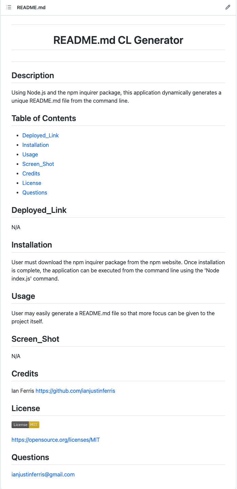

# <h1 align="center">  README.md CL Generator <h1>

## Description

Using Node.js and the npm inquirer package, this application dynamically generates a unique README.md file from the command line. 

## Table of Contents 

- [Deployed_Link](#Deployed_Link)
- [Installation](#Installation)
- [Usage](#Usage)
- [Screen_Shot](#Screen_Shot)
- [Credits](#Credits)
- [License](#License)
- [Questions](#Questions)

## Deployed_Link

https://watch.screencastify.com/v/HQxhx92ZKNymthfOLwdE

## Installation

User must download the inquirer package from npm website. Once installation is complete, the application can be executed from the command line using 'Node index.js' command. 

## Usage

User may easily create a README.md file so that more time can be focused on the project itself. 

## Screen_Shot

## Credits

Ian Ferris https://github.com/ianjustinferris

## License

https://opensource.org/licenses/MIT

## Questions

ianjustinferris@gmail.com

